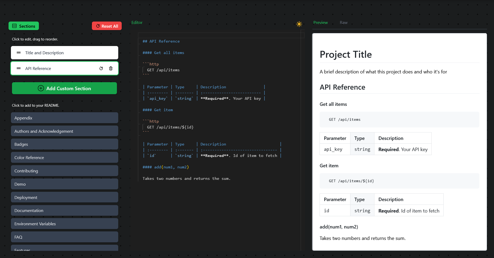

# ✨ ReadMePro - README Manager 

A web-based application built with Next.js and React to help developers easily create and manage professional README.md files using predefined and custom sections.

<!-- 📸 Add a screenshot or GIF demo of the application here! -->
  
*<p align="center">A versatile Markdown Editor</p>*

## 🚀 Description

Creating well-structured and informative README files is crucial for any project. ReadMePro aims to streamline this process by providing:

*   A set of common README **section templates** (like Title, Description, Installation, Usage, etc.).
*   The ability to add **custom sections** tailored to your project's needs.
*   An intuitive interface to **select, add, and reorder** sections using drag-and-drop.
*   An integrated **Markdown editor** (powered by Monaco Editor on desktop) to modify the content of each section.
*   A **live preview** panel to see how your README will render.
*   A **raw Markdown view**.
*   Persistence using **local storage**, so your work isn't lost on refresh.
*   The ability to **download** the complete generated README.md file.

## 🌟 Features

*   **Template Selection:** Choose from a predefined list of common README sections.
*   **Custom Sections:** Create your own sections with custom titles and content.
*   **Drag-and-Drop Reordering:** Easily arrange the selected sections in the desired order.
*   **Markdown Editor:** Edit section content with a feature-rich editor (Monaco on desktop, textarea on mobile).
*   **Live Preview:** See the rendered HTML output of your Markdown in real-time.
*   **Raw Markdown View:** View the combined raw Markdown source.
*   **Local Storage Persistence:** Automatically saves your selected sections, their order, and content modifications locally.
*   **Reset Functionality:** Reset individual sections or the entire structure back to defaults.
*   **Download:** Download the generated `README.md` file.
*   **Responsive Design:** Adapts to different screen sizes.

## 🛠️ Tech Stack

*   **Framework:** [Next.js](https://nextjs.org/) (with React)
*   **Styling:** [Tailwind CSS](https://tailwindcss.com/)
*   **Drag & Drop:** [`@dnd-kit/core`](https://dndkit.com/)
*   **Markdown Editor:** [`@monaco-editor/react`](https://github.com/suren-atoyan/monaco-react)
*   **Markdown Rendering:** [`react-markdown`](https://github.com/remarkjs/react-markdown) with `remark-gfm`


## ⚙️ Getting Started

Follow these steps to get the project running locally:

**Prerequisites:**

*   Node.js (Version >= 18.x recommended)
*   npm, yarn, bun or pnpm

**Installation & Running:**

1.  **Clone the repository:**
    ```bash
    git clone https://github.com/SecondMikasa/ReadMePro.git
    cd ReadMePro
    ```
2.  **Install dependencies:**
    ```bash
    bun install
    ```
3.  **Run the development server:**
    ```bash
    
    bun dev
    
    ```
4.  **Open your browser:**
    Navigate to [`http://localhost:3000`](http://localhost:3000) .

## 📝 Usage

1.  **Sidebar:**
    *   The left sidebar (expandable on mobile) shows your currently selected sections at the top and available sections below.
    *   Use the "Add Custom Section" button to create new, unique sections.
    *   Click on an available section to add it to your selected list.
    *   Use the "Reset All" button to clear your work and start fresh with only the default "Title and Description".
2.  **Selected Sections:**
    *   Drag the handle (`☰`) on a selected section to reorder it.
    *   Click on a selected section to focus it for editing.
    *   Use the reset (🔄) and delete (🗑️) icons (visible on focused/hovered items) to manage individual sections.
3.  **Editor/Preview Area:**
    *   When a section is focused, its Markdown content appears in the Editor panel.
    *   Modify the Markdown as needed. Changes are saved automatically to local storage.
    *   Switch between the "Preview" and "Raw" tabs to see the rendered output or the combined source code.
4.  **Download:**
    *   Click the "Download" button in the Navbar to download the generated `README.md` file containing the combined Markdown from your selected sections.

## 🤝 Contributing

Contributions are most welcome! If you'd like to contribute, please follow these steps:

1.  Fork the repository.
2.  Create a new branch (`git checkout -b feature/your-feature-name`).
3.  Make your changes.
4.  Commit your changes (`git commit -m 'Add some feature'`).
5.  Push to the branch (`git push origin feature/your-feature-name`).
6.  Open a Pull Request.

Please ensure your code follows the project's coding style and includes tests if applicable.

*This README was generated with help from [ReadMePro!](https://readmepro.vercel.app/)*